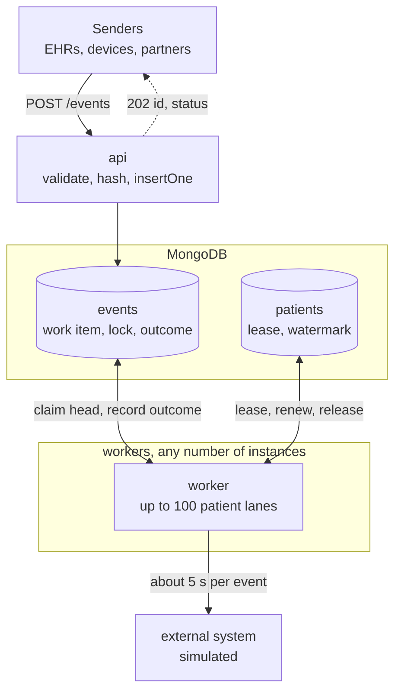
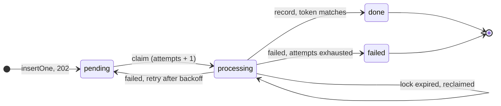

# Ingest Service

Accepts patient events over HTTP, answers the sender at once, processes each event
asynchronously against a slow external system, and records the outcome in MongoDB.
NestJS 11, TypeScript, native MongoDB driver.

```
docker compose up --build      # mongo + api + 1 worker
npm run load                   # second terminal: 1000 events/min for 3 minutes
npm run verify                 # checks every invariant against the database
```

`npm ci && npm test` needs nothing running: the tests start their own MongoDB.

## What the operating conditions imply

The assignment lists facts about the environment, not features. This is what each one
forces, what the design does about it, and where you can see it hold.

| Condition | What it forces | Design answer | Where to see it |
|---|---|---|---|
| A sender must get an answer immediately | Processing (about 5 s) cannot sit on the request path | Persist, then `202 Accepted` with the event id; processing is a separate loop | `POST` latency in the load report |
| 1000 events/min for hours, and growing | About 83 events in flight at steady state; no global serialization; must scale out | Workers process patients in parallel lanes (100 per instance by default); any number of instances share one database with no coordination but the database | `docker compose up --scale worker=2`, backlog line in `verify` |
| Senders time out, retry, and duplicate | The same event twice must be stored once and processed once | The event id is a hash of the payload; the insert is the dedupe | `load` sends 10% duplicates, `verify` compares distinct sent to stored |
| Events arrive out of order | Applying a patient's events in arrival order corrupts the patient's state | Per patient, events are applied in `ts` order after a short settling window; a late event is still applied and flagged `outOfOrder` | `load` shuffles each patient's sequence, `verify` checks completion order |
| A patient's sequence matters | Two workers must never work on one patient at once | A per-patient lease taken with one atomic upsert, renewed per event, expiring on crash | `verify` checks that no patient has overlapping processing windows |
| Clinical data may never be silently lost | Every accepted event must reach a visible terminal state | Acknowledge only after the write; expired locks are reclaimable; a permanent failure is a status, not a log line | `verify` finds every sent event `done` or `failed` |
| Clinical data may never be counted twice | A crash after the external call but before the record is written | A per-attempt lock token fences the outcome write; a stale attempt cannot record | Chaos recipe: a reclaimed event ends with one outcome and `attempts: 2` |
| Processes are killed mid-work | In-flight work must survive the death of its worker | Locks and leases carry a TTL and the claim query treats expired as free; there is no sweeper to keep alive | Chaos recipe |
| Deploys send SIGTERM | Drain, do not drop | Stop claiming, finish in-flight events inside a grace period, release leases, then close the database | `docker compose stop worker` log lines |
| Clinical data | Payloads in logs are a finding | `data` and `result` are never logged, only ids; strict DTO whitelist; 256 KB body cap | grep the logs after a load run |

## Architecture



One image, one codebase, one environment variable: `ROLE=api` serves HTTP only, `ROLE=worker`
runs the processing loop only, `ROLE=both` (the default) does both in one process. Compose runs
one `api` and a scalable `worker`.

**MongoDB is the queue.** The `events` document is the work item, the lock, and the outcome
record, all in one. There is no broker and no second store to reconcile with, so "never lost,
never counted twice" is a property of one collection's writes rather than of a dual-write
between a queue and a database. Every state transition is a single conditional update.

**A lease is not an outcome.** The assignment asks for outcomes in a single collection, and
`events` is that collection: every event's status, attempts, timing, result, and error live on
its one document. A second collection, `patients`, holds coordination state only: which worker
currently holds a patient, and the highest `ts` applied so far. That state is not about any
event and belongs to no event. Folding it into `events` as lock documents of a different kind
would pollute every read of the outcome collection to save one `createCollection`.

### Request path

1. `ValidationPipe` (`whitelist`, `forbidNonWhitelisted`, `transform`) rejects unknown or
   malformed fields with `400`. It is registered as a provider, so a test app built from
   `AppModule` validates exactly like production. A `ts` more than five minutes ahead of our
   clock is also rejected: one far-future timestamp would become its patient's ordering
   watermark and flag every later event, permanently.
2. The event id is computed: SHA-256 over `patientId`, `type`, `ts` as epoch milliseconds, and
   `data` with keys sorted at every depth. Two payloads that mean the same thing get the same
   id, whatever the key order.
3. One `insertOne` with that `_id`, status `pending`, `notBefore` set to now plus the settling
   window. A duplicate-key error means the event already exists, and the sender gets the
   existing document's id and status. The response is identical for a first send and a retry,
   which is what a retrying sender needs.
4. `202 { id, status }`. `GET /events/:id` shows the document at any later point.

### Worker path

A worker runs up to `WORKER_CONCURRENCY` lanes. Each lane owns one patient at a time:

1. Find patients with claimable work (pending and past `notBefore`, or processing with an
   expired lock), oldest first.
2. Take the patient's lease: one upsert on `patients` that succeeds only if no live lease
   exists. A duplicate-key error means another worker has it; move on.
3. Claim the patient's head event: the smallest-`ts` unfinished event. If that event is not
   ready yet (still in its settling window, waiting out a retry backoff, or locked by a live
   attempt), the lane leaves the patient alone until then. Nothing behind the head is touched,
   so a hiccup on one event cannot reorder the patient. The claim is a conditional
   `findOneAndUpdate` that sets a fresh lock token and bumps `attempts`.
4. Run the processor. Advance the patient's watermark with `$max` and read the previous value:
   if this event's `ts` is behind it, the event arrived late and is flagged `outOfOrder`.
5. Record the outcome with a write that matches `{ _id, lockToken }`. If the lock was lost in
   the meantime, the write matches nothing and the outcome is discarded, because another
   attempt owns the event now.
6. On failure, put the event back as `pending` with an exponential backoff, up to
   `MAX_ATTEMPTS`; then mark it `failed` with the error message. Both writes are fenced by the
   same token.
7. Renew the lease before each event; release it when the patient has nothing ready.

The life of one event, as `status` on its document:



A reclaim is the same transition as a first claim, on a document whose lock has expired. The
retry edge is why `notBefore` exists: a failed attempt goes back to `pending` with a later
claim time, and the patient's line holds behind it.

Crash recovery is the same query as normal work. A dead worker's locks and leases expire, and
the claim predicates treat expired as available. No sweeper, no heartbeat table, nothing that
itself has to be kept alive.

### Data model

`events` (the collection of record):

| Field | Meaning |
|---|---|
| `_id` | SHA-256 of the canonical payload |
| `patientId`, `type`, `data`, `ts` | The event as sent; `ts` as a Date |
| `receivedAt` | Our clock at receipt; tie-break for equal `ts` |
| `status` | `pending`, `processing`, `done`, `failed` |
| `notBefore` | Earliest claim time: receipt plus settling window, or the next retry |
| `attempts` | Incremented on every claim, including reclaims after a crash |
| `lockToken`, `lockedBy`, `lockedUntil` | The current attempt; cleared on any outcome |
| `outOfOrder` | Set on `done` when the event was applied behind the patient's watermark |
| `processedAt`, `result`, `error` | The outcome. `error` survives a later success as retry history |

`patients` (coordination only): `_id` is the patient id, `leaseOwner` and `leaseUntil` are
the current lease, `lastAppliedTs` is the ordering watermark.

Indexes: `{ status, notBefore }` and `{ status, lockedUntil }` for the candidate scan,
`{ patientId, status, ts, receivedAt }` for the per-patient head.

## Decisions and trade-offs

Each decision, why it won, and what it costs.

**MongoDB as the queue, not a broker.** Zero extra infrastructure, and the work item and its
outcome are the same record. The downside is the polling claim: every idle worker scans for
candidates on a backoff up to two seconds. At today's volume the scan is a rounding error
next to the five-second call, but it is the part that does not scale out with more workers,
and it is where the growth path in the last section starts.

**Native driver behind repositories, not an ODM.** The correctness of this service is a
handful of atomic updates: the insert that dedupes, the upsert that is the lease, the
conditional update that is the claim, the fenced write that records the outcome. I want to
read those as the driver calls they are, for the same reason I reach for a query builder over
an ORM on SQL. The downside is that schema shape lives in TypeScript types and indexes are
declared by hand, with no document layer to enforce either.

**Content-hash identity.** Senders send no id, so identity has to come from the payload. The
downside is that a sender who corrects an event (same patient, type, and `ts`, different
`data`) creates a second event rather than replacing the first, and a sender who legitimately
sends two byte-identical events (which the `ts` makes unlikely) gets one. An
`Idempotency-Key` header would let cooperative senders override this; see the last section.

**Per-patient ordering by `ts` with a settling window, late events flagged.** The service
acknowledges before it can know whether an older event is still on its way, so rejecting late
events is impossible and holding events forever is unacceptable. The window
(`ORDERING_GRACE_MS`, 2 s) absorbs ordinary reordering in transit. An event that arrives after
its successors were applied is still applied, and flagged so downstream can decide. The cost
is two seconds added to every event's time to completion, paid whether or not anything
arrived out of order, and a flagged event has still been applied out of sequence; only an
event-sourced patient state could fold it in properly.

**A transient failure holds the patient's line.** A failed attempt is retried with backoff,
and the patient's later events wait for it. This is the conservative choice for clinical
data: a retry must not silently reorder a patient. The downside is that one flaky event stalls
one patient for the duration of its backoffs (about a minute at the defaults). Only a
terminal `failed` lets the line move on.

**At-least-once processing, exactly-once recording.** A worker can die after the external
call and before the record is written. The next attempt calls the external system again, and
the fencing token guarantees that only one attempt records an outcome. Exactly-once against an
external system that offers no idempotency is not achievable by any client; the service passes
the event id with every call so a system that does offer it can dedupe.

**No ordering across patients.** None is needed by the conditions, and none is promised.

**One image, three roles.** The accept path and the process path scale differently (one API
instance handles the traffic comfortably, worker count follows the backlog), and a single
switch shows that with no duplication.

**Nest 11, Jest, ESLint, zod for config.** The defaults a Nest reader expects, so there is
nothing in the toolchain to explain. Configuration is validated once at boot by a zod schema
and injected as a typed `ConfigService`; a bad value fails the start, not the first request.

## Seeing it hold up

`npm run load` fires events at a fixed rate with exact duplicates mixed in and each patient's
sequence lightly shuffled, samples the backlog from `/health`, and waits for the queue to
drain. `npm run verify` checks the database against what was sent, one line per invariant,
exit code 1 on any failure. The default run, one api and one worker container, measured
locally:

```
sent 3000 in 179.9s: 2711 distinct, 289 duplicates (0 got a different id), 0 rejected
POST /events latency ms: p50 1.6, p99 2.8, max 20.9

PASS  no loss, no duplicates                   2711 distinct sent (289 duplicates, 0 mismatched), 2711 stored, 0 missing, 0 extra
PASS  every event reached a terminal status    done 2711, failed 0, pending 0, processing 0
PASS  no terminal failures                     0 failed (expected only with FAILURE_RATE set)
PASS  per-patient completion follows ts order  0 violations across 200 patients; 1314 late arrivals flagged outOfOrder
PASS  no patient processed concurrently        0 overlapping processing windows (delay 5000ms, tolerance 5ms)
PASS  no reclaims without a chaos step         0 events with attempts > 1: none
PASS  backlog stayed bounded                   pending max 36, cap 250, 38 samples
7 passed, 0 failed
```

The late-arrival count is the generator's own doing: with 200 patients sending round-robin, a
shuffled event can arrive 48 seconds after its successor, far outside the settling window.
Those events are applied and flagged rather than silently reordered, which is the flag doing
its job on traffic harsher than the condition describes.

Knobs: `npm run load -- --rate 1000 --minutes 3 --patients 200 --dup 0.1 --shuffle 5`, and
`npm run verify -- --delay-ms 5000` must match the worker's delay for the exclusivity check.

### Chaos recipe

Two workers, one killed mid-run, restarted, then verified.

```
docker compose up --build --scale worker=2 -d
npm run load                                                  # second terminal
docker kill -s KILL "$(docker compose ps -q worker | head -1)"   # ~30 s in, while load runs
docker compose up -d --scale worker=2                            # bring it back; wait for load to finish
npm run verify -- --chaos
```

`--chaos` flips one check: reclaims are now expected, and the line reports how many events
carry `attempts > 1`. Every other invariant must still pass. Recovery takes up to
`LEASE_TTL_MS` (30 s), the time a dead worker's locks stay live.

The SIGTERM variant is `docker compose stop worker` during a run. The worker stops claiming,
finishes the events it holds, releases its leases, and exits 0:

```
[WorkerService] worker stopped, drained 72 in-flight lane(s)
[MongoModule] Mongo client closed
```

Compose's `stop_grace_period` (20 s) sits above `SHUTDOWN_GRACE_MS` (15 s), so the platform
never cuts the drain short. To see retries and terminal failures, set `FAILURE_RATE=0.3` on
the worker and read the `failed` line of `verify`.

### Health

`GET /health` returns `200` with the database ping, the backlog by status, and the role, or
`503` when the database is unreachable. A large backlog is degraded, not down: a probe that
restarts a busy worker only deepens it.

## Configuration

Every variable, its default, and what it does is in `.env.example`. All values are validated
by a zod schema at boot, so a bad one fails the start, not the first request.

## Tests

`npm test` runs unit and integration tests against a MongoDB started by
`mongodb-memory-server`; `npm run test:e2e` builds the real `AppModule` and drives it with
`supertest`. CI runs lint, typecheck, build, both suites, and the Docker build.

Covered, in order of how much would go wrong without it:

- **Repository writes**: the insert dedupes; the claim is conditional; an expired lock is
  reclaimable and a live one is not; every outcome write refuses a stale token; the head is
  held when the next event is not ready.
- **Lease and watermark**: two workers cannot hold one patient; a stale owner cannot renew.
- **Two workers on one database**: no patient processed by both, `ts` order kept, a late
  arrival flagged, a dead worker's leftovers recovered with `attempts: 2`, a stalled attempt
  fenced out after the handover.
- **Worker loop**, with fakes: concurrency cap, backoff and give-up, blocked patients
  skipped, shutdown drains.
- **HTTP contract**: `202` shape, same receipt on a retry, `400` per validation rule, `404`,
  `/health` `200` and `503`.
- **Configuration**: defaults, coercion, and a rejected bad value.

Not tested on purpose: the real five-second sleep, Terminus internals, the load script.

## With more time

- **Sender authentication**: a guard on the controller, per-sender HMAC or mTLS. Not evaluated
  here, and the first thing to add before real senders.
- **`Idempotency-Key` header** as an override of the content hash for senders that can supply
  one, which also solves the corrected-event case.
- **Event-sourced patient state**, so a late event is folded in rather than flagged.
- **Kafka partitioned by `patientId`** when the polling claim becomes the bottleneck. Partition
  ordering and single-consumer partitions give per-patient order and exclusivity natively. The
  `events` collection becomes an outbox, the workers become consumers, and the lease and lock
  layer is deleted. Before that step, partitioning the claim scan by `hash(patientId) % N` per
  worker cuts lease contention with no new infrastructure.
- **A lock heartbeat during the external call.** Today a lock must outlive the call, and the
  configuration refuses a lease shorter than twice the processing delay. A call that can stall
  needs a renewal loop instead of a bound.
- **Replay endpoint** (`POST /events/:id/retry`) for `failed` events, which today are replayed
  by resetting their status by hand.
- **Metrics and a correlation id**: backlog, lane utilization, lease conflicts, and an id per
  request through `AsyncLocalStorage`.
- **Archival** of `done` events; the collection grows forever as specified.
- **A replica set with majority write concern** in a real deployment. Local runs a single node,
  where "acknowledged" means one node's journal.

## Develop

```
docker compose up -d mongo
npm ci
npm run start:dev          # ROLE=both against the compose Mongo
npm run lint && npm run typecheck && npm test && npm run test:e2e
```
